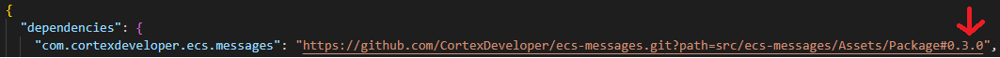
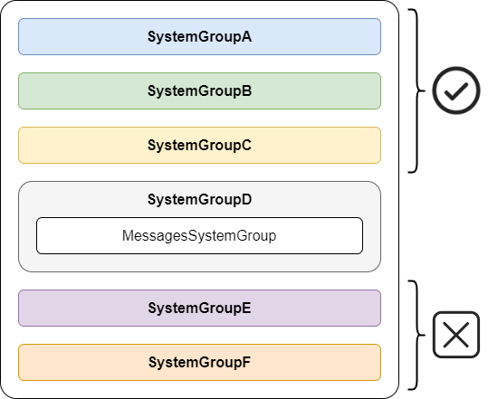
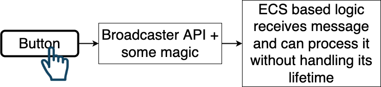
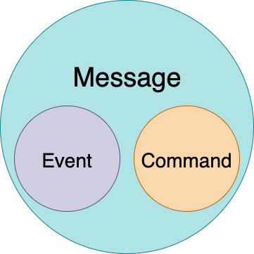
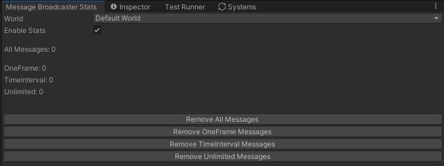
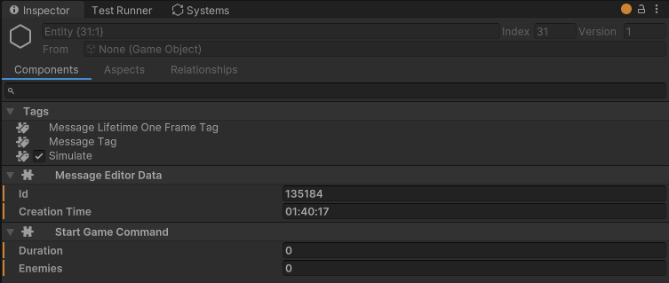

ecs-messages
============

     

- [ecs-messages](#ecs-messages)
  - [Overview](#overview)
  - [Installation](#installation)
  - [Initialization](#initialization)
  - [Disposing](#disposing)
  - [Use Cases](#use-cases)
    - [UI and ECS](#ui-and-ecs)
    - [Gameplay and Non-Gameplay/Meta Game](#gameplay-and-non-gameplaymeta-game)
  - [Semantic of messages](#semantic-of-messages)
  - [Features](#features)
    - [Lifetime Types](#lifetime-types)
    - [Multiple Worlds](#multiple-worlds)
  - [Code Examples](#code-examples)
    - [Post API](#post-api)
      - [One Frame Messages](#one-frame-messages)
        - [Case: Pause game](#case-pause-game)
        - [Case: Start game by clicking Start button](#case-start-game-by-clicking-start-button)
      - [Time Interval Messages](#time-interval-messages)
        - [Case: Informing that quest available only for 600 seconds(10 minutes)](#case-informing-that-quest-available-only-for-600-seconds10-minutes)
      - [Unlimited Lifetime Messages](#unlimited-lifetime-messages)
        - [Case: Notify that quest is completed](#case-notify-that-quest-is-completed)
    - [Immediate Post API](#immediate-post-api)
        - [Case: Post pause message immediately](#case-post-pause-message-immediately)
    - [Remove API](#remove-api)
  - [Editor Features](#editor-features)
    - [Stats Window](#stats-window)
    - [Message Entity](#message-entity)
    - [Message Entity Editor Name](#message-entity-editor-name)
  - [Samples](#samples)
  - [Contacts](#contacts)

## Overview

This messaging system can be used as bridge between MonoBehavior logic and ECS logic.<br/>
Also it serves as commucation tool between ECS systems for some cases.<br/>

Key features:
- Simple API that ease to read
- Handling messages lifetime(creation details, auto deleting according to configured rules, etc)
- Supports *IComponentData* as message content
- Multiple worlds support

> Tested with Unity DOTS ECS v1.0.10 and Unity 2022.3.0 LTS

## Installation

Add package via Package Manager -> Add package from git URL.<br/>
Package path in "manifest.json" should looks like:<br/> 
https://github.com/CortexDeveloper/ecs-messages.git?path=src/ecs-messages/Assets/Package#x.x.x"<br/>

Where "x.x.x" is version of package.<br/> 
Also pay attention that package code located in "src/ecs-messages/Assets/Package".<br/>



Or simply clone repository into your project.

## Initialization

Service must be initialized for each world separetely.
For this purposes use API below in your entry point.

```csharp
World defaultWorld = World.DefaultGameObjectInjectionWorld;
//pass world and parent system group for messages internal systems
MessageBroadcaster.InitializeInWorld(defaultWorld, defaultWorld.GetOrCreateSystemManaged<SimulationSystemGroup>());
```

Internal systems contains ones that remove messages automatically.<br/>
So, it's better to place it under parent system group close to the end of your systems execution order.<br/>

Let's look on quick example.

If you post OneFrame message and expect it to processed in **SystemGroupC** - that's fine.<br/>
Because ECSMessages internal systems was initialized in **SystemGroupD** after **SystemGroupC**.<br/>

But if you post OneFrame message and trying to process it in **SystemGroupE** - that's not ok.<br/>
Because message would be deleted inside internal system before it reach **SystemGroupD**.<br/>



So, that's the reason why ECSMessages systems should be placed after systems that depends on it.

## Disposing

Service also have API to dispose from world.

```csharp
World defaultWorld = World.DefaultGameObjectInjectionWorld;

MessageBroadcaster.DisposeFromWorld(defaultWorld);
```

## Use Cases

### UI and ECS 

There are a lot of reasons to implement UI logic via *Object Oriented Design*.<br/>
So we need somehow connect our ECS gameplay parts and interface elements.<br/>
For example start match by clicking button or do something on swiping up on mobile phone.<br/>



### Gameplay and Non-Gameplay/Meta Game

It also OK for communication between ECS Systems without carying about entities-messages creation and deleting.<br/>
As example we can talk about achivements. Player lost match but game designer wants to give him achivement as reward.<br/>
So, *CharacterDeathSystem* just post message that available only for **one frame** via service API and hopes that *AchievementsListenerSystem* will catch it and send analytics data.<br/>

## Semantic of messages

In ECS we can say that commands and events are entities with bunch of special components.<br/>
So, from computer point of view they looks almost identicaly but not for developer.<br/>
Both are messages but with different semantic.<br/>
The difference between them in reasons why they were sent to world.<br/>
Event notifies that owner of this event **changed its own state**.<br/>
Command, despite they also just an entity with some components, **have intention to change someones state**.<br/>
In classic OOP paradigm command is a peace of logic that have form of object. But in ECS we can operate only with data.



> Event - entity with bunch of components that notifies world about owner changed state.<br/> 
> Command - entity with bunch of components that have intetion to change someones state.<br/>

## Features

### Lifetime Types

Message can be one of three types:

***OneFrame*** - message will live only one frame and then would be deleted.<br/> 
Removing handled by service.

***TimeInterval*** - message will live amount of time that was configured on message creation.<br/> 
Messages with limited lifetime bound to real time.<br/>
Auto deleting still managed by service.<br/>

***Unlimited*** - unmanaged by service type.<br/> 
Special messages that might be useful for cases when you don't know exactly the lifetime.<br/>
In this case you should manually deal with it and delete message after usage.<br/>

### Multiple Worlds

Messages can be posted via EntityCommandBuffer or EntityManager. Both of them belong to some world.<br/> 
So, if you want to post message in certain world just use ECB or EM from proper one.

## Code Examples

### Post API

#### One Frame Messages

Messages of this type will be alive only for one frame and then would be automatically deleted.<br/>
Pay attention that dividing messages to "events" and "commands" performed for semantic purposes.<br/>
That helps to quickly catch the intention of this message.

##### Case: Pause game

```csharp
var ecb = yourEntityCommandBufferSystem.CreateCommandBuffer();

// It will be automatically deleted after one frame
MessageBroadcaster
    .PrepareMessage()
    .AliveForOneFrame()
    .Post(ecb, new PauseGameCommand());

// Message component must implement an interface IMessageComponent
public struct PauseGameCommand : IComponentData, IMessageComponent { }
```

##### Case: Start game by clicking Start button

```csharp                
var ecb = yourEntityCommandBufferSystem.CreateCommandBuffer();

MessageBroadcaster
    .PrepareMessage()
    .AliveForOneFrame()
    .Post(ecb, new StartMatchCommand
    {
        DifficultyLevel = Difficulty.Hard,
        MatchLength = 300f,
        EnemiesCount = 25
    });

public struct StartMatchCommand : IComponentData, IMessageComponent
{
    public Difficulty DifficultyLevel;
    public float MatchLength;
    public int EnemiesCount;
}
```

#### Time Interval Messages

##### Case: Informing that quest available only for 600 seconds(10 minutes)

```csharp
// It will be automatically deleted after 1 minute
MessageBroadcaster
    .PrepareMessage()
    .AliveForSeconds(60f)
    .Post(ecb, new QuestAvailabilityData { Quest = Quests.SavePrincess });
```

#### Unlimited Lifetime Messages

##### Case: Notify that quest is completed

```csharp
// It would be posted as usual message but should be deleted manually
// There is no special system for this type that handling deleting automaticaly
MessageBroadcaster
    .PrepareMessage()
    .AliveForUnlimitedTime()
    .Post(ecb, new QuestCompletedEvent { Value = Quests.KillDiablo });
```

### Immediate Post API

For some cases it's necessary to post message not via ECB system but right now via EntityManager.<br/>
Here is alternative way how to post message.

##### Case: Post pause message immediately

```csharp
// The only difference here is last method to post message
// It needs EntityManager instead of ECB
var entityManager = yourWorld.EntityManager;

Entity messageEntity = MessageBroadcaster
    .PrepareMessage()
    .AliveForOneFrame()
    .PostImmediate(entityManager, new PauseGameCommand());
```

Pay attention that *PostImmediate* method returns message entity.<br/>
Thats give you an oportunity to do whatever you want with message and control its lifetime manually.

### Remove API

Messages removing is supoused to be automated by service.<br/>
In case you realy need to manually delete message you can use EntityManager or EntityCommandBuffer API.<br/>
As far as message is just an entity with bunch of components, there is no special way of removing them from World.<br/>

If you need to delete messages of certain type use broadcaster API below.

```csharp
// removes all messages with given T component
MessageBroadcaster.RemoveAllMessagesWith<T>(ecb);
```

## Editor Features

### Stats Window 
Stats window located here *ECSMessages/Stats*.<br/>



### Message Entity

There is an example of components on message entity.<br/>
They might be useful for debug purposes. Each message have unique ID and stores creation time.



### Message Entity Editor Name

There is an optional feature that allows you to name message.<br/>
Pass *FixedString64Bytes* instance to method *PrepareMessage* to give a name to message.

```csharp
MessageBroadcaster
    .PrepareMessage(new FixedString64Bytes("PauseGameCommand"))
    .AliveForOneFrame()
    .Post(ecb, new PauseGameCommand());
```

## Samples

Check package samples to explore more examples.

## Contacts

Feel free to ask me any questions.<br/>
<cortexdeveloper@gmail.com>