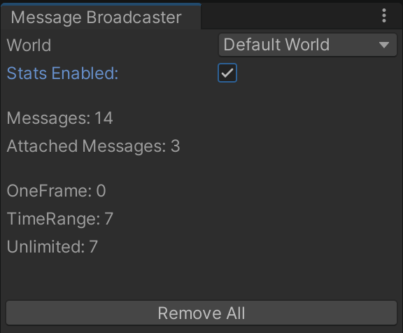
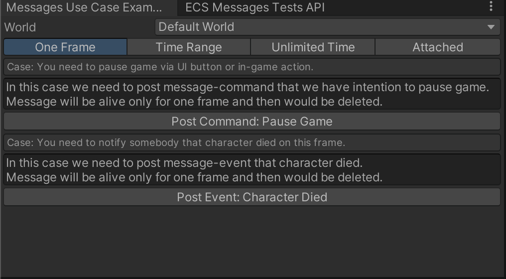

ecs-messages
============

  


Simple way of communication between MonoBehaviours and ECS world.<br/>
...and a little bit of other cool features :D

- [Overview](#overview)
- [Installation](#installation)
- [Use Cases](#use-cases)
  - [UI and ECS](#ui-and-ecs)
  - [Gameplay and Non-Gameplay/Meta Game](#gameplay-and-non-gameplaymeta-game)
- [Semantic of messages](#semantic-of-messages)
- [Features](#features)
  - [Lifetime Types](#lifetime-types)
- [Code Examples](#code-examples)
  - [Post API](#post-api)
  - [Immediate Post API](#immediate-post-api)
  - [Remove API](#remove-api)
- [Editor Features](#editor-features)
  - [Stats Window](#stats-window)
  - [Examples Editor Window](#examples-editor-window)
- [Contacts](#contacts)

## Overview

This messaging system can be used as bridge between MonoBehavior logic and ECS logic.<br/>
Also it serves as commucation tool between ECS systems for some cases.<br/>

Key features:
- Simple API that ease to read
- Handling messages lifetime(creation details, auto deleting according to configured rules, etc)
- Supports *IComponentData* as message content

> Tested with Unity DOTS ECS v0.51.0-preview.32 and Unity 2021.3.6f1

## Installation

Add package via Package Manager -> Add package from git URL.<br/>
Package path in "manifest.json" should looks like:<br/> 
https://github.com/CortexDeveloper/ecs-messages.git?path=src/ecs-messages/Assets/Package#x.x.x"<br/>
Where "x.x.x" is version of package. Also pay attention that package code located in "src/ecs-messages/Assets/Package".<br/>

Or simply clone repository into your project.

> Later versions will be added to OpenUPM too

## Use Cases

### UI and ECS 

There are a lot of reasons to implement UI logic via *Object Oriented Design*.<br/>
So we need somehow connect our ECS gameplay parts and interface elements.<br/>
For example start match by clicking button or do something on swiping up on mobile phone.<br/>


### Gameplay and Non-Gameplay/Meta Game

It also OK for communication between ECS Systems without carying about entities-messages creation and deleting.<br/>
As example we can talk about achivements. Player lost match but game designer wants to give him achivement as reward.<br/>
So, *CharacterDeathSystem* just post message that available only for **one frame** via service API and hopes that *AchievementsListenerSystem* will catch it and send analytics data.<br/>

## Semantic of messages

In *Data Oriented Design* we can say that commands and events are enteties with bunch of special components.<br/>
So, from computer point of view they looks almost identicaly but not for developer.<br/>
Both are messages but with different semantic.<br/>
The difference between them in reasons why they were sent to world.<br/>
Event notifies that owner of this event **changed its own state**.<br/>
Command, despite they also just an entity with some components, **have intention to change someones state**.<br/>
In classic OOP paradigm command is a peace of logic that have form of object. But in Data Driven Design we can operate only with data.


> Event - entity with bunch of components that notifies world about owner changed state.<br/> 
> Command - entity with bunch of components that have intetion to change someones state.<br/>

## Features

### Lifetime Types

Message can be one of three types:

*OneFrame* - message will live only one frame and then would be deleted.<br/> 
Removing handled by service.

*TimeRange* - message will live amount of time that was configured on message creation.<br/> 
Messages with limited lifetime bound to real time.<br/>
Auto deleting still managed by service.<br/>

*Unlimited* - unmanaged by service type.<br/> 
Special messages that might be useful for cases when you don't know exactly the lifetime.<bt/>
In this case you should manually deal with it and delete message after usage.<br/>

## Code Examples

### Post API

#### One Frame Messages

Messages of this type will be alive only for one frame and then would be automatically deleted.<br/>
Pay attention that dividing messages to "events" and "commands" performed for semantic purposes.<br/>
That helps to quickly catch the intention of this message.

##### Case: Pause game

```csharp
var ecb = yourEntityCommandBufferSystem.CreateCommandBuffer();
// It will be automatically deleted after one frame
MessageBroadcaster
    .PrepareMessage()
    .AliveForOneFrame()
    .Post(ecb, new PauseGameCommand());

// Message component must implement an interface IMessageComponent
public struct PauseGameCommand : IComponentData, IMessageComponent { }
```

##### Case: Start game by clicking Start button

```csharp                
var ecb = yourEntityCommandBufferSystem.CreateCommandBuffer();
MessageBroadcaster
    .PrepareMessage()
    .AliveForOneFrame()
    .Post(ecb, new StartMatchCommand
    {
        DifficultyLevel = Difficulty.Hard,
        MatchLength = 300f,
        EnemiesCount = 25
    });

public struct StartMatchCommand : IComponentData, IMessageComponent
{
    public Difficulty DifficultyLevel;
    public float MatchLength;
    public int EnemiesCount;
}
```

#### Time Range Messages

##### Case: Informing that quest available only for 600 seconds(10 minutes)

```csharp
// It will be automatically deleted after 1 minute
MessageBroadcaster
    .PrepareMessage()
    .AliveForSeconds(60f)
    .Post(ecb, new QuestAvailabilityData { Quest = Quests.SavePrincess });
```

#### Unlimited Lifetime Messages

##### Case: Notify that quest is completed

```csharp
// It would be posted as usual message but should be deleted manualy
// There is no special system for this type that handling deleting automaticaly
MessageBroadcaster
    .PrepareMessage()
    .AliveForUnlimitedTime()
    .Post(ecb, new QuestCompletedEvent { Value = Quests.KillDiablo });
```

### Immediate Post API

For some cases it's necessary to post message not via ECB system but right now via EntityManager.<br/>
Here is alternative way how to post message.

##### Case: Post pause message immediately

```csharp
// The only difference here is last method to post message
// It needs EntityManager instead of ECB
var entityManager = yourWorld.EntityManager;
MessageBroadcaster
    .PrepareMessage()
    .AliveForOneFrame()
    .PostImmediate(entityManager, new PauseGameCommand());
```

### Remove API

```csharp
// removes message
MessageBroadcaster.RemoveMessage(ecb, entityManager, messageEntity);

// removes message via EntityManager right now
MessageBroadcaster.RemoveMessageImmediate(entityManager, messageEntity);

// removes all messages with given T component
MessageBroadcaster.RemoveAllMessagesWith<T>(ecb);
```

## Editor Features

### Stats Window 
Stats window located here *DOTS/ECSMessages/Stats*.<br/>
It shows count of active messages in chosen world and provide API to remove all messages via editor.<br/>



### Examples Editor Window

You can also explore examples *Tools/Messages Examples* if you download package source code.<br/>



## Contacts

Feel free to ask me any questions.<br/>
<cortexdeveloper@gmail.com>