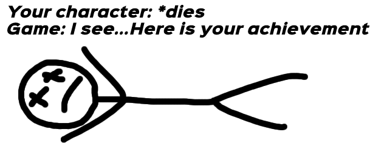
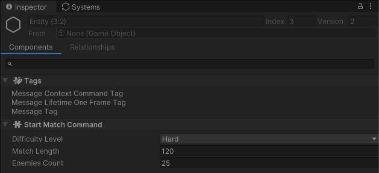
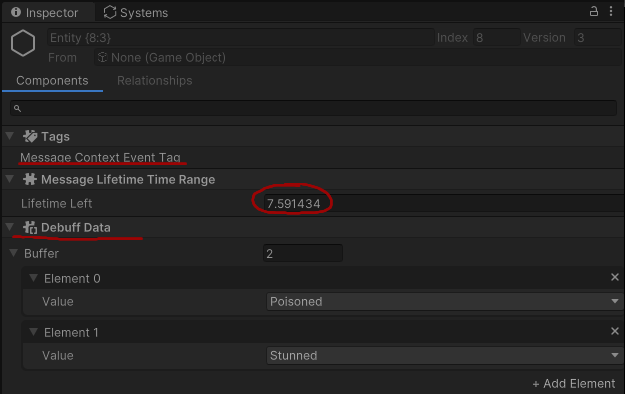

ecs-messages
============

Simple way of communication between MonoBehaviours and ECS world.<br/>
...and a little bit of other cool features :D

- [Overview](#overview)
- [Use Cases](#use-cases)
  - [UI and ECS](#ui-and-ecs)
  - [Gameplay and Non-Gameplay/Meta Game](#gameplay-and-non-gameplaymeta-game)
- [Idea](#idea)
- [Features](#features)
  - [Lifetime Types](#lifetime-types)
  - [Unique Messages](#unique-messages)
- [Code Examples](#code-examples)
  - [Post API](#post-api)
  - [Remove API](#remove-api)
- [Editor Features](#editor-features)
  - [Stats Window](#stats-window)
  - [Structure of message entity](#structure-of-message-entity)
  - [Examples Editor Window(only for source code)](#examples-editor-windowonly-for-source-code)
- [Next Versions Roadmap](#next-versions-roadmap)
- [Contacts](#contacts)

## Overview

This messaging system for DOTS implementation of ECS solves some problems of messaging.<br/>
It can be used as bridge between MonoBehavior based logic and ECS based logic or interaction service for ECS systems.<br/>

Key features:
- Simple API that ease to read
- Handling messages lifetime(creation details, auto deleting according to configured rules, etc)
- Supports *IComponentData* or *IBufferElementData* as message content

## Use Cases

### UI and ECS 

There are a lot of reasons to implement UI logic via *Object Oriented Design*.<br/>
So we need somehow connect our ECS gameplay parts and interface elements.<br/>
For example start match by clicking button or react somehow when swiping up on mobile phone.<br/>


### Gameplay and Non-Gameplay/Meta Game

It also OK for communication between ECS Systems without carying about entities-messages creation and deleting.<br/>
As example we can talk about achivements. Player lost match but game designer wants to give him achivement as reward. Naive people...<br/>
So, *CharacterDeathSystem* just post message that available only for **one frame** via service API and hopes that *AchievementsListenerSystem* will react somehow to this sad news.<br/>

Another good example is analytics. Tracking mechanisms can be built with messaging system too.<br/>



## Idea

In *Data Oriented Design* we can say that commands and events are enteties with bunch of special components.<br/>
So, from computer point of view they looks almost identicaly but not for developer.<br/>
Both are messages but with different semantic.<br/>
The difference between them in reasons why they were sent to world.<br/>
Event notifies that owner of this event **changed its own state**.<br/>
Command, despite they also just an entity with some components, **have intention to change someones state**.<br/>
In classic OOP paradigm command is a peace of logic that have form of object. But in Data Driven Design we can operate only with data.<br/>
Practicaly it can be used as filter to separate commands and events with same components. 


> Event - entity with bunch of components that notifies world about owner changed state.<br/> 
> Command - entity with bunch of components that have intetion to change someones state.<br/>

## Features

### Lifetime Types

Message can be one of three types:
 - OneFrame
 - TimeRange
 - Unlimited

*OneFrame* - message will live only one frame and then would be deleted.<br/> 
Removing handled by service.

*TimeRange* - message will live amount of time that was configured on message creation.<br/> 
Messages with limited lifetime bound to real time.<br/>
Auto deleting still managed by broadcaster service.<br/>

*Unlimited* - unmanaged by service type.<br/> 
Special messages that might be useful for cases when you don't know exactly the lifetime.<bt/>
In this case you should manually deal with it removing from world after usage.<br/>

### Unique Messages

Message can be marked as ***unique***. In this case you cannot post another one message if same type already active.<br/>
This feature might be useful for different cases. Let's say, you want to inform your teamate that magic portal is opened for 30 seconds.<br/>
You post event by clicking some buttom. What will happen if start spamming it? A lot of duplicates of event would be posted.<br/>
Event marked as ***unique*** won't be posted twice in row and prevents this kind of situtations.<br/> 
Check code examples to discover more detailed explanation how it works.<br/>

## Code Examples

### Post API

#### One Frame Messages

Messages of this type will be alive only for one frame and then would be automatically deleted.<br/>
Pay attention that dividing messages to "events" and "commands" performed more for semantic and filtering purposes.<br/>

##### Case: You need to pause game via UI button or in-game action

```csharp
// Just start from method PrepareCommand() in static class MessageBroadcaster and then call Post(...).
MessageBroadcaster
    .PrepareCommand()
    .Post(new PauseGameCommand());

// Command is just a component
public struct PauseGameCommand : IComponentData { }
```

##### Case: You need to start game by clicking Start button

```csharp             
// Very similar situation as previous but here used AsUnique() configuration.
// This means that message wont be posted if there is already an active message of this type.      
MessageBroadcaster
    .PrepareCommand()
    .AsUnique()
    .Post(new StartMatchCommand
    {
        DifficultyLevel = Difficulty.Hard,
        MatchLength = 300f,
        EnemiesCount = 25
    });

public struct StartMatchCommand : IComponentData
{
    public Difficulty DifficultyLevel;
    public float MatchLength;
    public int EnemiesCount;
}
```

##### Case: You need to notify somebody that character died on this frame
```csharp
MessageBroadcaster
    .PrepareEvent()
    .Post(new CharacterDeadEvent { Tick = 1234567890 });
```

#### Time Range Messages

##### Case: Informing other non-gameplay related systems that there are two active debuffs

```csharp
// Here we add additional configuration WithLifeTime(...) to mark message as TimeRange type.
// It won't be posted if there is already an active message of this type.
// It will be automatically deleted after 10 seconds.
// Also we used API that work with IBufferElementData interface to attach multiple elements to message.
MessageBroadcaster
    .PrepareEvent()
    .AsUnique()
    .WithLifeTime(10f)
    .PostBuffer(
        new DebuffData { Value = Debuffs.Stun },
        new DebuffData { Value = Debuffs.Poison });
```

##### Case: Informing that quest available only for 600 seconds(10 minutes)

```csharp
MessageBroadcaster
    .PrepareEvent()
    .WithLifeTime(600f)
    .Post(new QuestAvailabilityData { Quest = Quests.SavePrincess });
```

#### Unlimited Lifetime Messages

##### Case: Notify that quest is completed

```csharp
MessageBroadcaster
    .PrepareEvent()
    .WithUnlimitedLifeTime()
    .Post(new QuestCompletedEvent { Value = _completedQuest });
```

##### Case: RTS player wants any free worker to start digging gold

```csharp
MessageBroadcaster
    .PrepareCommand()
    .WithUnlimitedLifeTime()
    .Post(new DigGoldCommand());
```

### Remove API

There are examples of API to remove active messages.<br/>
> **_NOTE:_** Current package version doesn't have filters to remove commands or events separetely.<br>

```csharp
// Remove all messages of TimeRange lifetime type 
MessageBroadcaster.RemoveWithLifetime(MessageLifetime.TimeRange);

// Remove messages with specific component 
MessageBroadcaster.Remove<DigGoldCommand>();

// Remove messages with specific DynamicBuffer<T> where T is DebuffData
MessageBroadcaster.RemoveBuffer<DebuffData>();

// Remove all active messages of all types
MessageBroadcaster.RemoveAll();
```

## Editor Features

### Stats Window 
Stats window can be accessed by *Tools/Message Broadcaster Stats*.<br/>
It shows count of active messages by type and provide few API calls to remove messages via editor.<br/>


### Structure of message entity

Lets discover few enteties from examples.<br/>

#### IComponentData as message content example



*MessageContextCommandTag* - internal stuff to mark entity as "message-command".<br/>
This one is OneFrame type, so it would be deleted on next frame.<br/>
*StartMatchCommand* is common ECS component attached to command as content.<br/>

#### DynamicBuffer as message content example



*MessageContextEventTag* - internal stuff to mark entity as "message-event".<br/>
This one is TimeRange type, so we can track how much time left to deletion.<br/>
*DebuffData* is just a *DynamicBuffer* that attached to this event as content.<br/>

### Examples Editor Window(only for source code)

You can also explore examples *Tools/Messages Examples* if you download package source code.<br/>


## Next Versions Roadmap

- Unique messages(only one instance of type can be active)
- Messages with multiple components(without DynamicBuffer)
- Remove API with more filters
- Bursted version of *MessagesRemoveByComponentCommandListenerSystem*
- More examples
- Additional features for Editor Stats window
- Performance optimization
- Performance benchmark
- Unit tests

## Contacts

Feel free to ask me any questions.<br/>
<cortexdeveloper@gmail.com>