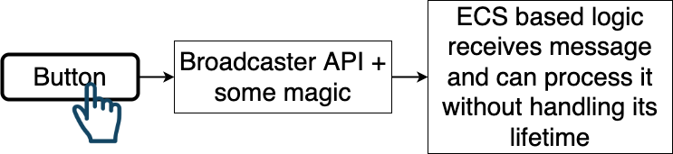
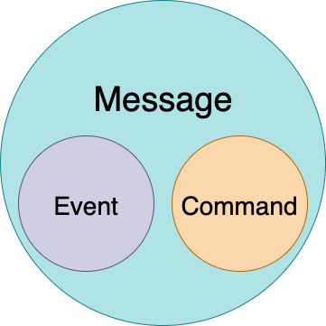

# ecs-messages
Simple way of communication between MonoBehaviours and ECS world.<br/>
...and a little bit of other cool features :D

## Overview

This messaging system for DOTS implementation of ECS solves some problems of messaging.<br/>
It can be used as bridge between MonoBehavior based logic and ECS based logic or interaction service for ECS systems.<br/>

Key features:
- Simple API
- Handling messages lifetime(creation details, auto deleting according to configured rules, etc)
- Supports any *IComponentData* or *IBufferElementData* as message content

## Use Cases

### UI and ECS 

There are a lot of reasons to implement UI logic via *Object Oriented Design*.<br/>
So we need somehow connect our ECS gameplay parts and interface elements.<br/>
For example communication between UI layer(buttons, swipe gesture) and ECS gameplay logic(start match by click, pause game).<br/>



### ECS Gameplay logic with Non-Gameplay logic 

It also OK for communication between ECS Systems without carying about entities-messages creation and deleting.<br/>
Or classic architecture aproach interaction with high performance parts implemented with ECS pattern.<br/>
As example we can talk about achivements. Our player suddendly met "Game Over" window but game designer wants to give you achivement as reward. Naive people...<br/>
So, *CharacterDeathSystem* just post message that available only for **one frame** via service API and hopes that *AchievementsListenerSystem* will react somehow to this sad news.<br/>


## Idea

In *Data Oriented Design* we can say that commands and events are enteties with bunch of special components.<br/>
So, from computer point of view they looks almost identicaly but not for developer.<br/>
Both are messages but with different semantic.<br/>
The difference between them in reasons why they were sent to world.<br/>
Event notifies that owner of this event **changed its own state**.<br/>
Command, despite they also just an entity with some components, **have intention to change someones state**.<br/>
In classic OOP paradigm command is a peace of logic that have form of object. But in Data Driven Design we can operate only with data.<br/>
Practicaly it can be used as filter to separate commands and events with same components. 



> Event - entity with bunch of components that notifies world about owner changed state.<br/> 
> Command - entity with bunch of components that have intetion to change someones state.<br/>

## Code Examples

### Post API

#### One Frame Messages

Messages of this type will be alive only for one frame and then would be automatically deleted.<br/>
Pay attention that dividing messages to "events" and "commands" performed more for semantic and filtering purposes.<br/>

##### Case: You need to start game by clicking "Start" button

```csharp             
// Broadcast service API looks like:        
MessageBroadcaster
    .PrepareCommand()
    .Post(new StartMatchData
    {
        DifficultyLevel = Difficulty.Hard,
        MatchLength = 300f,
        EnemiesCount = 25
    });

// Where command just a common struct with implemented IComponentData interface
public struct StartMatchCommand : IComponentData
{
    public Difficulty DifficultyLevel;
    public float MatchLength;
    public int EnemiesCount;
}
```
##### Case: You need to pause game via UI button or in-game action

```csharp
// Same flow goes here too
MessageBroadcaster
    .PrepareCommand()
    .Post(new PauseGameCommand());

// Component without any fields
public struct PauseGameCommand : IComponentData { }
```

##### Case: You need to notify somebody that character died on this frame
```csharp
MessageBroadcaster
    .PrepareEvent()
    .Post(new CharacterDeadEvent { Tick = 1234567890 });
```

#### Time Range Messages

Messages with limited lifetime bound to real time.<br/>
Auto deleting still managed by broadcaster service.<br/>

##### Case: Informing other non-gameplay related systems that there are two active debuffs

```csharp
// Here we add additional params to mark message as TimeRange type
// It will be automatically deleted after 10 seconds
// Also we used API that work with IBufferElementData interface to attach multiple elements to message
MessageBroadcaster
    .PrepareEvent()
    .WithLifeTime(10f)
    .PostBuffer(
        new DebuffData { Value = Debuffs.Stun },
        new DebuffData { Value = Debuffs.Poisoned });
```

##### Case: Informing that quest available only for 600 seconds(10 minutes)

```csharp
MessageBroadcaster
    .PrepareEvent()
    .WithLifeTime(600f)
    .Post(new QuestAvailabilityData { Quest = Quests.SavePrincess });
```

### Unlimited Lifetime Messages

Special messages that might be useful for cases when you dont know exactly the lifetime.<bt/>
In this case you should manualy deal with it removing from world after usage.<br/>

##### Case: Notify that quest is completed

```csharp
MessageBroadcaster
    .PrepareEvent()
    .WithUnlimitedLifeTime()
    .Post(new QuestCompletedEvent { Value = _completedQuest });
```

##### Case: RTS player wants any free worker to start digging gold

```csharp
MessageBroadcaster
    .PrepareCommand()
    .WithUnlimitedLifeTime()
    .Post(new DigGoldCommand());
```

### Remove API

There are examples of API to remove active messages.<br/>
>> ! Current package version doesn't have a filters to remove only commands or events separetely.<br>

```csharp
// Remove all messages of TimeRange lifetime type 
MessageBroadcaster.RemoveWithLifetime(MessageLifetime.TimeRange);

// Remove messages with specific component 
MessageBroadcaster.Remove<DigGoldCommand>();

// Remove messages with specific DynamicBuffer<T> where T is DebuffData
MessageBroadcaster.RemoveBuffer<DebuffData>();

// Remove all active messages of all types
MessageBroadcaster.RemoveAll();
```

## Editor Features

*WIP*

## Next Versions Roadmap

- Unique messages(only one instance of type can be active)
- Messages with multiple components(without DynamicBuffer)
- Remove API with more filters
- Bursted version of *MessagesRemoveByComponentCommandListenerSystem*
- More examples
- Additional features for Editor Stats window
- Performance optimization
- Performance benchmark
- Unit tests

## Contacts

Feel free to ask me any questions.<br/>
<cortexdeveloper@gmail.com>